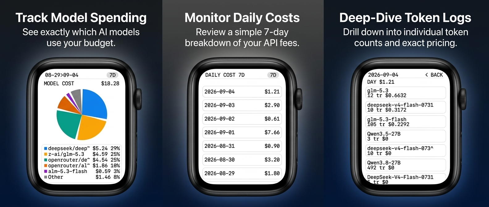

# AI Cost Tracker

A handheld AI-spend monitor for the **Waveshare ESP32-S3-Touch-AMOLED-1.8** — a 7-day model cost distribution pie, a daily-cost list, and a per-model drill-down for every day, in a warm cream / dark-navy two-theme UI with cached-slide transitions, an idle auto-dim, and a pull-down version drawer.

> **v1.0.0 ships on sample data.** The week on screen is 4 transcribed days + 3 synthetic days baked into the firmware. A live RDSec provider drops in behind the existing `IDataProvider` seam — no scene changes needed.

## Install / Flash

**For normal use, flash the factory binary. No build needed.**

1. Install esptool: `pip install esptool`, plug in the board over USB-C.
2. Flash at offset `0x00`: `esptool --chip esp32s3 --port /dev/cu.usbmodem* write_flash 0x00 release/ai-cost-tracker-v1.0.0-factory.bin`
3. Wait for "Hard resetting via RTS pin", then the pie appears (~5s).
4. Stuck on "Waiting for download"? Hold BOOT, tap reset, release BOOT, retry step 2.

## How to use

Four screens, all touch:

- **Pie (home)** — 7-day model cost distribution with grow animation and count-up total. Title row shows the date range and week total.
- **Daily list** — swipe left from pie. 7 newest-first day cards with totals (max day highlighted). Tap a row to drill in.
- **Day drill-down** — per-model rows for the day: unique-shortened model names, trace counts, costs ($0 rows dimmed, never hidden). Drag vertically to scroll long days. Swipe left/right to step between adjacent days.
- **Version drawer** — swipe down from the top edge anywhere. Shows **AI Cost Tracker** + `v1.0.0` badge. Dismiss via swipe up, swipe right, or `< BACK`.

**Gestures:** swipe left/right = navigate · swipe down from top edge = version drawer · tap = open row / BACK · vertical drag (drill-down) = scroll · PWR short-press = light/dark toggle (persisted in NVS) · PWR long-press (~4s) = hardware power-off.

**Power:** the panel auto-dims after 30s idle and wakes on any touch or PWR press (the waking touch never navigates). Brightness defaults: 150 light / 200 dark.

## Status

Running on hardware (V2 CO5300 + CST820 unit). All 8 host test suites green (data, aggregator, input, theme, byte-swap, manager, idle, render), device build clean at ~7.7% RAM / ~7% flash. Verified on glass: warm + cold (unplug/replug) boot, theme toggle + persistence, swipe chain end-to-end, dim/wake cycle, per-day drill-down for all 7 days.

### Sample data

The v1 week (newest first): 2026-09-04 $1.2095 · 2026-09-03 $2.9003 · 2026-09-02 $0.6147 · 2026-09-01 $7.6579 · plus 3 flagged synthetic days (08-29…08-31). Raw provider-prefixed model strings are kept distinct and aggregated by exact name; display labels uniquify on collision (`openrouter/deepseek-v~` vs `deepseek/deepseek-v-f~`).

## Hardware

- Board: [ESP32-S3-Touch-AMOLED-1.8](https://www.waveshare.com/wiki/ESP32-S3-Touch-AMOLED-1.8) (V2: **CO5300** display + **CST820** touch; V1 SH8601/FT3168 auto-detected by touch-probe, same PCB/pin map).
- 1.8" 368×448 portrait AMOLED (QSPI, 80 MHz), capacitive touch (I2C 400 kHz, INT on GPIO21).
- **AXP2101** PMU (PWR button, panel rail BLDO1 = OLED VDD 3.3V — enabled explicitly before display init, or cold boots come up black), **XCA9554** expander (LCD/touch reset + SD power — pulsed before everything).
- ESP32-S3 dual-core 240 MHz, 8 MB octal PSRAM (the ~330 KB framebuffer lives there), 16 MB flash.

## Developer build info

PlatformIO + pioarduino Arduino-ESP32 3.3.11, direct `Arduino_GFX` rendering (no LVGL). Key libraries: `GFX_Library_for_Arduino` (vendored in `lib/`), `lewisxhe/XPowersLib@^0.2.6`, `adafruit/Adafruit XCA9554@^1.0.0`.

```bash
pio run -e aicost                    # device build
pio run -e aicost -t upload          # flash (auto-reset, BOOT rarely needed)
make -f test/Makefile data agg input theme swap manager idle render   # host suites (no hardware)
```

Board config: `esp32-s3-devkitc-1`, `qio_opi` PSRAM, 16 MB flash, `ARDUINO_USB_MODE=1 + CDC_ON_BOOT=1`, QSPI flags `-DESP32QSPI_MAX_PIXELS_AT_ONCE=4096 -DESP32QSPI_FREQUENCY=80000000`, monitor 115200 baud. Bring-up order is load-bearing: Serial/Wire → NVS theme → expander reset → PMU init + BLDO1 → display → touch. Framebuffer pixels must be byte-swapped (`fb_encode.h`) — the QSPI bus runs `setNoSwap(true)` and ships bytes as-is to a big-endian panel; symmetric black/white masked this for months.

### Layout

- `src/main.cpp` — bring-up, 30 fps frame gate, touch poll → gesture → scene dispatch, PWR/idle policy
- `src/data/` — `model.h` structs, `IDataProvider.h` seam, `SampleProvider` (offline week), `Aggregator` (top-5+Other roll-up, unique short names)
- `src/ui/` — `PieScene` (scanline wedge fill), `ListScene`, `DetailScene` (drag scroll), `VersionScene` (drawer), `SceneManager` (stillness gate, settled-cache slide compositor, modal stack), `Theme` (light/dark palettes, NVS), `IdleDim` (30s dim state machine), `Tween`, `DotFont` (solid 5×7 + chrome), `composite.h`
- `src/input/` — `Touch` (raw-Wire CST820), `Gesture` (tap/swipe/drag classifier)
- `src/display.*`, `src/pmu_axp2101.*`, `src/expander.*`, `src/fb_encode.h` — hardware layer
- `test/` — host suites + BMP render harness (`test/shim/` stubs the GFX driver)
- `release/` — `ai-cost-tracker-v1.0.0-factory.bin` + `FLASH.md`

### Serial console (115200)

`[touch] tap/swipe` gesture log · `[scene] pie/list/detail/version enter` · `[theme] light/dark` · `[display] dim/wake` · `AICOST boot ok`.

## Known issues & limits

- **Sample data only** — the live RDSec fetch is the obvious v2; the seam is ready, the network code isn't written.
- **First-visit entry slides render live** (~150ms/frame, one steppy transition per new screen); repeat visits composite from cache at ~30fps. By design, but visible.
- **Occasional tap slowness** — animation frames can hog the loop ~100ms; a tap landing exactly inside one feels delayed. Rare by construction, not yet profiled out.
- **No version string was on screen before v1.0.0** — the drawer fixes this going forward (`FW_VERSION` in `config.h`).
- **Dead code to sweep**: `DOT_RADIUS`/`DOT_PITCH` defines (orphaned by the block-text switch), `drawLine` shim stub (nothing calls it since scanlines), `panel_variant` plumbing (only V2 exercised on real hardware).
